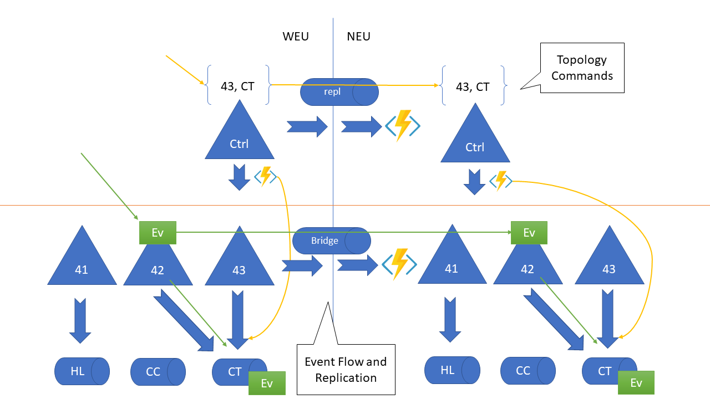

# Azure Service Bus "Active/Active" Sample 

This code sample illustrates multi-region active/active topology management 
and operations for Azure Service Bus.

The motivation for this sample stems from several customer conversations where
the customers felt that they need an high-availability setup that goes beyond
what Service Bus readily offers within one Azure region.

Within a region, especially those with availability zone support, Service Bus is
the leading high-availability, transactional message broker. Any Service Bus 
namespace is hosted inside a cluster that is made up to 32-128 VMs, strategically
placed across several fault domain boundaries and, with availability zones, spanning
multiple physical facilities that are several miles apart from each other. All 
VM hosts and the brokers inside of them are simultaneously active and dynamically
share the load, with failures being compensated automatically. While it's difficult 
to express this in an SLA, we can state with the confidence of looking back at
nearly 10 years of operations that these clusters have 100% availability. The metric
we are tracking instead of availability is reliability, reflecting the error rate. 
A cluster can be available, but yet sporadically return errors due to the dynamic 
nature of the system. Storage operations may fail, replication may get backed up, 
indiviandual machines may crash, etc. Our objective is to generally exceed 99.99% of 
reliability and we are routinely meeting 99.999% over the course of each week.

What all of this reliability and availability work cannot defend against are 
external factors, specifically networking issues between the clients and Service Bus.

Some customers have usage scenarios where the Service Bus clients must reside outside
the cloud ("at the edge") because that's where actions take place. Think of a scenario
where mail orders can be placed at a physical store on the one hand, and those orders
then get routed to a fulfillment center on the other. Or think of a scenarios where 
shipping containers are unloaded at a port and the information must be forwarded to 
the shippers' clients' on-premises data centers. Those scenarios will have active 
logic running in the cloud, but for the system to work, all participating sites 
need connectivity. 

For time-sensitive scenarios, loss of connectivity from a site to a specific Azure 
region due to a network misconfiguration (locally, at the ISP, or in the Backbone)
or due to more dramatic reasons like an undersea cable being severed, may quite well
be a class of disaster that stops all business operations. Payments at stores cannot 
be cleared, bags cannot be loaded onto aircraft, or packages can't be delivered. 
Such a networking issue may only affect a segment of Internet access and 
the route to an alternate Azure region might quite well be okay. 

This sample aims to illustrate an application-level solution pattern for creating an
active-active(-active) setup where multiple namespaces across multiple regions can share
the same topology setup and messages/events are then deliberately replicated between
the sites such that they are available when and where needed in case of external
networking issues. 

> A "magic" multi-region message broker is an interesting thought experiment, but 
keep in mind that the semantics of a queue message are often that it ought to be
handled once and once only, which differs very significantly from how database 
records are used. The full delivery state of each message would therefore have to
be synchronously and fully consistently replicated across geographically distributed
sites and you would probably not like the performance penalty.

Mind that this is an illustration of patterns and not a ready-to-use framework.

## Overview

The sample addresses two distinct concerns: Synchronization of the topology model
across multiple namespaces at the control plane level and replication of event flows
at the data plane level.

### Control Plane

For keeping the topology model (the layout of the namespace with queues and topics
and subscriptions) in sync, we move all control plane activities into the application
itself. To create a new queue, you don't modify the namespace externally, but you 
issue a command, via a "control" topic on the namespace. The topic is subscribed to
by a handler associated with the namespace, which then realizes the command by creating
the requested queue. 

This model has the advantage that it scales to any number of namespaces with very little
effort and it leverages the robustness of queues, meaning that failures to create the 
desired entities due to transient conditions can be easily handled with retries. 

A replication route for the control commands is set up with an further subscription on 
the control topic which is then read by a simple "pump". A pump is some code, in this 
sample an Azure Function, that reads messages from a source and sends them to a target. 

For the two namespace replication model we show here, there is one such subscription.
For replicating to multiple namespaces, the requisite subscriptions can be attached to 
any of the control topics in any of the namespaces and commands will propagate to all
namespaces, irrespective of which control topic they were submitted to. If you need a 
topology change, you issue one command somewhere and that command is realized everywhere.     

### Data Plane

The data plane topology shown here is made up of some elements that replicate data and
some elements that do not. 

Queues are used as per-namespace building blocks for the topology. The picture above
represents a container terminal at a port, and the queues "CC", "HL", and "CT" are 
acting as mailboxes for shipping companies into which messages from docks are forwarded
when one of their ships is docked there.

Those "mailboxes" are maintained per namespace.

Topics are used to provide pub/sub functionality inside a namespace and also 
instead of plain queues when multi-region replication óf queue messages is required.

     

 

      

     